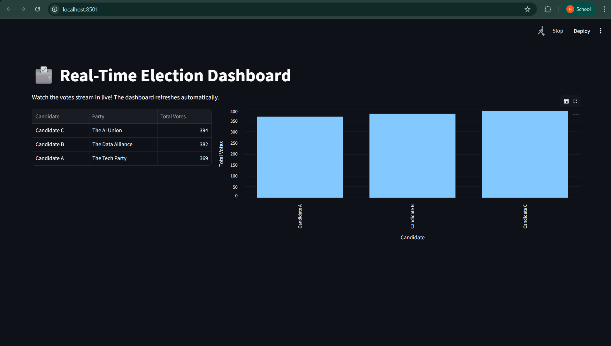

# 🗳️ Real-Time Election Voting Pipeline

A complete end-to-end data engineering pipeline that simulates live election voting, processes the votes in real-time, and displays the results on a live updating dashboard.

## 🏗️ Architecture & Tech Stack

This project uses a modern streaming architecture built entirely in Docker:

* **Python (Producer):** Generates continuous live JSON vote payloads.
* **Apache Kafka (KRaft Mode):** The ingestion engine, running completely without Zookeeper.
* **Apache Spark Streaming:** The processing brain. Catches the Kafka stream, aggregates the votes, and pushes them out.
* **PostgreSQL:** The analytical storage layer holding the aggregated results.
* **Streamlit:** A live, auto-refreshing UI that visualizes the final output in real-time.


## ⚙️ Prerequisites
* Docker & Docker Compose
* Python 3.9+
* Required Python packages: `confluent_kafka`, `pyspark`, `streamlit`, `pandas`, `psycopg2-binary`

## 🚀 How to Run the Pipeline

**1. Define the Infrastructure**
Start Postgres, Kafka, and the Spark Cluster:
```bash
docker compose up -d
```

**2. Initialize the Database**
Create the tables and insert the candidate data:
```bash
python database_init.py
```

**3. Start the Vote Generator**
Run the producer to start streaming votes into Kafka:
```bash
python voting_producer.py
```

**4. Start the Spark Streaming Job**
Open a new terminal and tell the Spark cluster to start consuming and processing the Kafka stream:
```bash
docker exec -it spark-master spark-submit --packages org.apache.spark:spark-sql-kafka-0-10_2.12:3.5.0,org.postgresql:postgresql:42.6.0 /app/spark_processor.py
```

**5. Launch the Live Dashboard**
In a final terminal, launch Streamlit to watch the votes tally up:
```bash
streamlit run app.py
```

## 📸 Dashboard Preview




## 💡 Lessons Learned
* Navigated Docker internal/external networking to allow host machines and containers to communicate with Kafka.
* Upgraded Kafka to KRaft mode (bypassing Zookeeper) for a more modern, lightweight footprint.
* Handled dependency management for Apache Spark to seamlessly connect Kafka streams to JDBC (Postgres) outputs.

